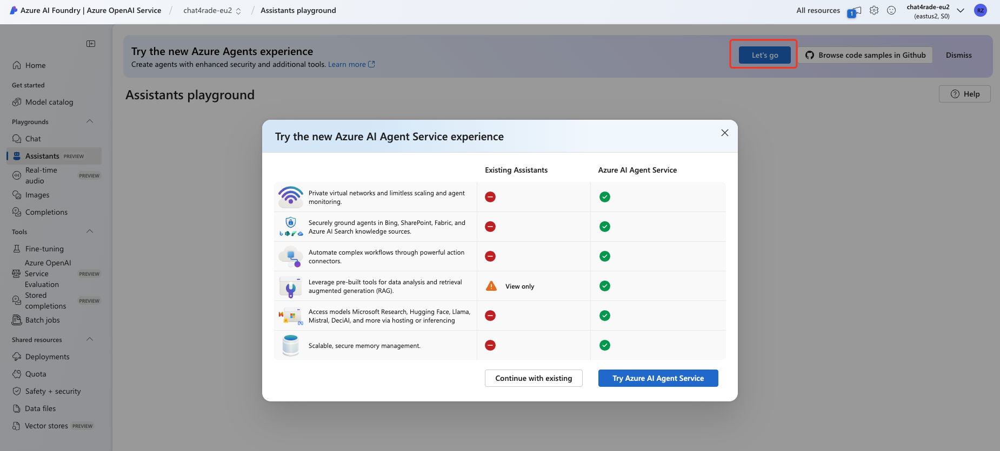

# Lab 3 - Azure AI Foundry Agent 服务体验
## Portal里使用
- 可以用Lab1里的环境， 如果没有[创建AI Hub和Project](
https://learn.microsoft.com/en-us/azure/ai-services/agents/quickstart?pivots=ai-foundry)
  现在还是预览阶段，可能需要开启才能使用Agent服务

- 添加Grounding with Bing 服务
https://learn.microsoft.com/en-us/azure/ai-services/agents/how-to/tools/bing-grounding?view=azure-python-preview&tabs=python&pivots=overviewd

## SDK : 
- https://github.com/Azure/azure-sdk-for-python/tree/azure-ai-projects_1.0.0b5/sdk/ai/azure-ai-projects/samples/agents
- https://github.com/kinfey/MultiAIAgent

## 选做 - 部署多Agent应用
 https://azure.github.io/ai-app-templates/repo/azure-samples/agent-openai-java-banking-assistant/

