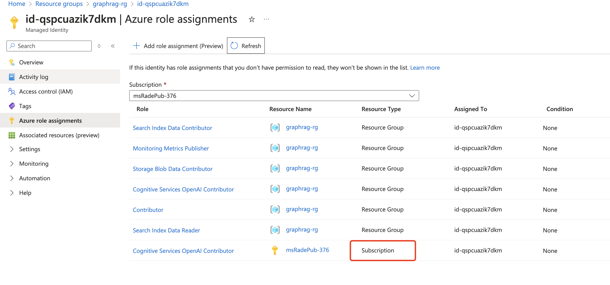

# Lab4 - 选做 - GraphRAG on Azure 快速部署
[参考repo](https://github.com/Azure-Samples/graphrag-accelerator)
https://github.com/radezheng/graphrag-accelerator-0217/blob/main/docs/DEPLOYMENT-GUIDE.md

## 准备
- 安装工具 [前置准备](https://github.com/radezheng/graphrag-accelerator-0217/blob/main/docs/DEPLOYMENT-GUIDE.md#prerequisites)
- Azure 订阅, 需要Contributor + RBAC role assignment权限 或者 Owner权限。
- 注册资源提供者(Resource Provider) 
```bash
# register providers
az provider register --namespace Microsoft.OperationsManagement
az provider register --namespace Microsoft.AlertsManagement
# verify providers were registered
az provider show --namespace Microsoft.OperationsManagement -o table
az provider show --namespace Microsoft.AlertsManagement -o table
```
- 部署环境登录Azure CLI
```bash 
# login to Azure - may need to use the "--use-device-code" flag if using a remote host/virtual machine
az login
# check what subscription you are logged into
az account show
# set appropriate subscription
az account set --subscription "<subscription_name> or <subscription id>"
```

## 部署步骤
- Git Clone 项目
```bash 
https://github.com/radezheng/graphrag-accelerator-0217
```

- 创建资源组
```bash
az group create --name <my_resource_group> --location <my_location>

# example
az group create --name rg-graphrag-accelerator-rg --location japaneast
```

- 准备模型endpoint和key, 参考 [这里](https://learn.microsoft.com/zh-cn/azure/ai-studio/how-to/deploy-models-openai)
    - 部署gpt-4o 或 4o-mini
    - 部署embbedding model, 例如 text-embedding-ada-002

 - 修改参数文件 **infra/deploy.parameters.json**, 参考 [这里](https://github.com/radezheng/graphrag-accelerator-0217/blob/main/docs/DEPLOYMENT-GUIDE.md#4-fill-out-infradeployparametersjson)

- 部署
```bash
cd infra
bash deploy.sh -h # view help menu for additional options
#出错改正后可重复运行。
bash deploy.sh -p deploy.parameters.json
```

- 部署前端界面， 参考 [这里](https://github.com/radezheng/graphrag-accelerator-0217/tree/main/frontend)
<br/>

在项目根目录创建.env文件，内容如下
```bash
DEPLOYMENT_URL=https://<my_apim>.azure-api.net
APIM_SUBSCRIPTION_KEY=<my_apim_subscription_key>
DEPLOYER_EMAIL=abc@test.com 
```
DEPLOYMENT_URL 是 Gateway URL

APIM_SUBSCRIPTION_KEY 是订阅key


  - 本地运行:
```bash
# 在项目根目录下运行
docker build -t graphrag:frontend -f docker/Dockerfile-frontend .
docker run --env-file <env_file> -p 8080:8080 graphrag:frontend
```
  - 本地访问 http://localhost:8080


- 部署到Azure 参考 [这里](https://github.com/radezheng/graphrag-accelerator-0217/tree/main/frontend#host-ui-in-azure)

### 错误处理
- 如果遇到以下错误，需要修改文件


注释掉342行， 


在Portal确认identity已经有如下权限，没有就手工添加

重新运行deploy.sh命令
```bash
bash deploy.sh -p deploy.parameters.json
```
